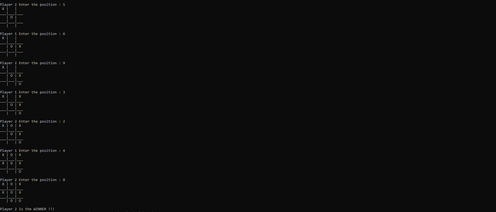

# TIC-TAC-TOE

This is a Tic Tac Toe game developed in C++

Player 1 -> X  
player 2 -> O

Player 1 Starts the Game  

Game ends when either of the player wins or its a draw

##### GAME SCREEN SHOT

